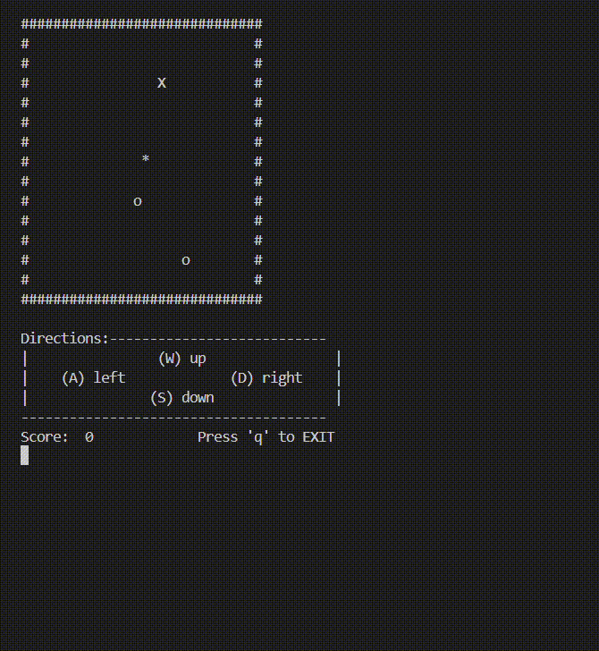

# Snake-Game
Object-oriented implementation of the classic Snake game developed in C++, using both custom data structures and modular game architecture. 

# Gameplay
The GIF below demonstrates the completed game, including player movement, snake growth, food collection, score tracking, and collision detection.

# Features
- Real-time keyboard controls (W, A, S, D)
- Dynamic snake growth when food is collected
- Collision detection with snake body and arena boundaries
- Score tracking system
- Multiple food types with unique gameplay effects
- Modular object-oriented design

# Project Structure
- 📍 Project — Main game loop and overall program flow.
- 📍 Player — Handles snake movement, growth, and direction updates.
- 📍 Food — Generates and manages food placement and special items.
- 📍 GameMechs — Controls game state, scoring, and input management.
- 📍 objPos / objPosArrayList — Custom classes used to store and manipulate game object positions.
- 📍 MacUILib — Console rendering and keyboard input interface.

# Concepts Demonstrated
- Object-Oriented Programming (OOP)
- Dynamic Memory Management
- Custom Data Structures
- Game Loop Architecture
- Modular Software Design
- Collision Detection Algorithms

# Build
Compile the project using the included makefile:
`make`
`./Project`
